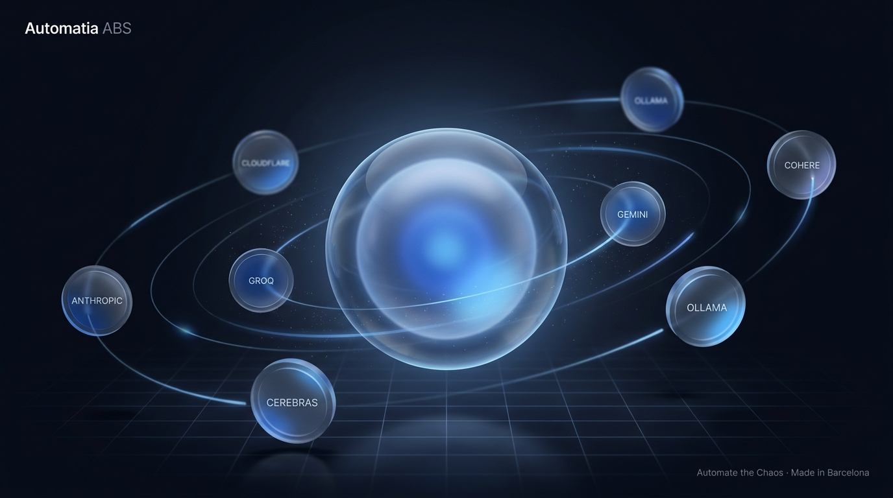
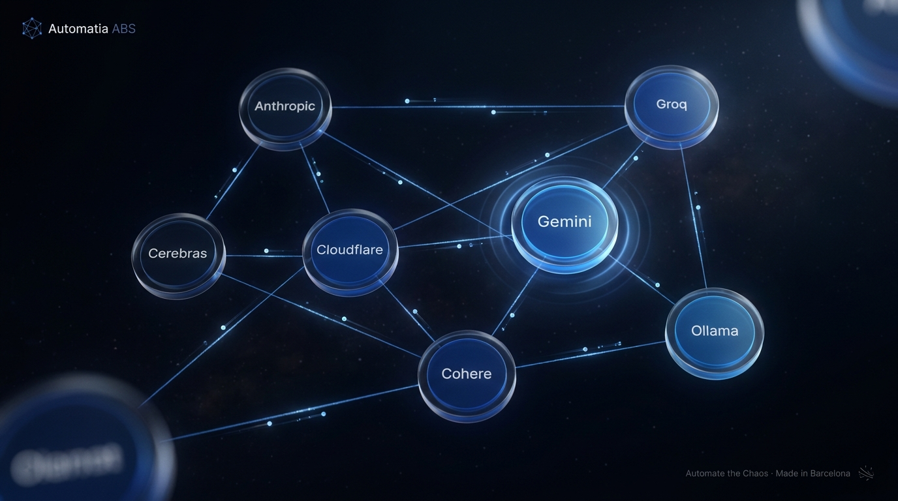
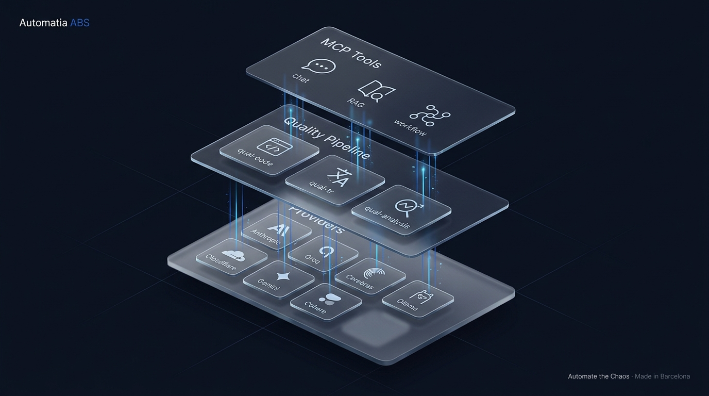

# Cosmos 3D Redesign — R2 Mockup Gate

> **Status:** WAITING FOR FOUNDER APPROVAL.
> Brief 2 §3 R2 — 3 mockup variants below. Pick one, then R3 (implementation) can begin.
> Branch: `feat/sprint-q12-deep-quality` · 2026-05-07.

## Decision rule

The mockups demonstrate the *aesthetic direction*, not final node copy. Provider name typos in the generated images (e.g. "ANTHROPIC" → ANTHROPIC, duplicate OLLAMA) will be corrected at implementation time — the gate is about *which language* (orbit / graph / iso-grid) we ship.

Reply with one of: `mockup_1` (Cosmos-orbital) · `mockup_2` (Force-directed graph) · `mockup_3` (Iso-axonometric). Optional: free-text adjustments (e.g. "graph but tighter cluster, drop the corner OOB nodes").

## Variant 1 — Cosmos-orbital (improved)

- Inspired by **Linear method** (glass orbits) + **GitHub Octoverse** (atmospheric depth).
- Core sphere = orchestrator; 7 satellite glass coins on physics-grounded ellipses.
- Single brand palette (`#0a0e1a / #1e57ac / #3a9dff / #78bdff`), gentle grid floor, real shadow casting.
- Strength: instantly readable as *AI orchestration*; "core attracts satellites" maps cleanly to cascade routing.
- Risk: orbits read as fixed hierarchy; users may misread architecture as static rather than dynamic.

## Variant 2 — Force-directed graph

- Inspired by **Vercel Insights** (node clusters) + **Three.js physics examples**.
- Provider nodes free-floating with luminous edges; particle data packets flow along edges.
- Active node (Gemini) has a pulse halo — direct mapping to "current cascade hop".
- Strength: visually *alive*, communicates "living nervous system" — best fit for cascade telemetry.
- Risk: dense topologies turn into hairballs without LOD culling + edge bundling.

## Variant 3 — Iso-axonometric grid

- Inspired by **Stripe Sigma** (layered card stacks) + **Anthropic research** (grid discipline).
- 3 layers stacked: *Providers* (bottom) → *Quality Pipeline* (middle) → *MCP Tools* (top); vertical light filaments = data flow up the stack.
- Strength: communicates *architecture* ("building blocks") clearly; safest for marketing screenshots; no occlusion at <30 nodes.
- Risk: static feel — needs subtle motion to avoid looking like a slide deck.

## Implementation notes (regardless of choice)

- Single brand palette enforced: `#0a0e1a` bg, `#1e57ac` primary, `#3a9dff` highlight, `#78bdff` accent. **No rainbow per provider.**
- Real Three.js depth via `MeshPhysicalMaterial { transmission: 0.6, thickness: 0.5, roughness: 0.1 }` — NOT CSS gradient.
- `prefers-reduced-motion` → static iso layout fallback (variant 3 inspired) regardless of chosen variant.
- Bundle delta budget ≤180 KB gz; 60 fps M4 / 30 fps Hetzner CX22 browser.
- Keyboard nav + ARIA labels (`role="button" aria-label="Anthropic provider, status: healthy"`).

## After approval — workflow

1. Founder writes choice into `artifacts/cosmos_redesign/approval.md` (one-line: `mockup_2 — 2026-05-07 founder@automatiabcn.com`).
2. R3 starts: `core/landing/components/CosmosGraph/` (react-three-fiber + drei + force lib if mockup_2).
3. R4 a11y, R5 tests (≥1827 backend), R6 atomic commit + image rebuild.

---

> Generated 2026-05-07 via `mcp__abs__gemini_image_pro` (gemini-3-pro-image-preview) — 3 × 16:9, total ~76 s, ~6 700 tok. R1 research synthesis via `mcp__abs__ask_kimi`. No direct Cohere/Gemini text-API calls (24 h cooldown respected).
